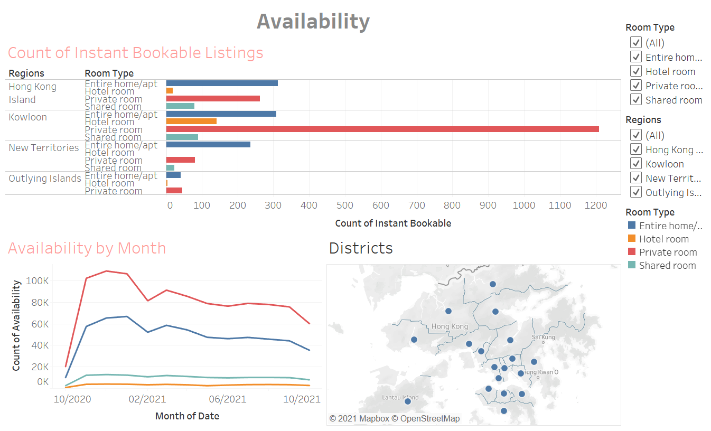
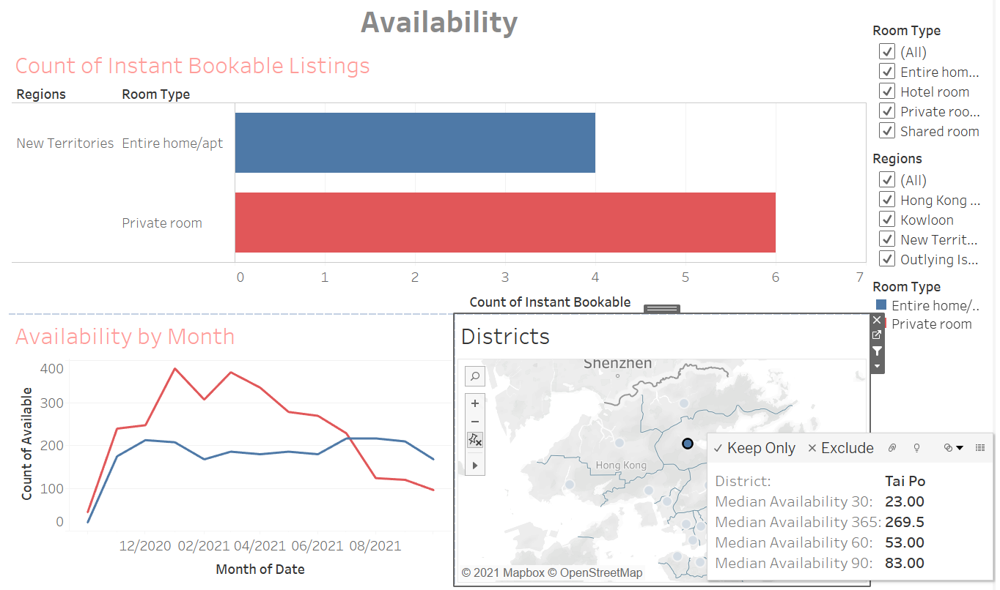

# Business Dashboard of Airbnb(HK)
 To build a dashboard for senior management to monitor the business condition of Airbnb(HK) with a single click on the interactive charts.
 
## Data source
 Data is obtained from [Inside Airbnb](http://insideairbnb.com/get-the-data.html) compiled on 25 Oct, 2020. Since no booking data is provided, revenue cannot be calculated to reveal the actual business performance. 

## Overview

Key points highlighted:
- Nearly half of the listings are concentrated in Yau Tsim Mong district, the center location of HK
- The most expensive listing is located in Yau Tsim Mong district, with an abnormally high price (81K per night)
- The most common room type in HK is private rooms

If only focus on the New Terrotories (including outlying islands), 

 
 
Key points highlighted:
 - Listings are concentrated most in Islands district, probably searving the needs of holiday accommodation
 - Listings are also concentrated in North district, which is a good choice for people frequently travelling to mainland China
 - More than half of the room type is entire home/apartment
 
 
## Pricing

**Focusing on "*District by Median Price*" section** 
Key points highlighted:
- Southern district has the highest price level
- Central & Western district has an unexpectedly lower price level than Kwau Tsing and other 2 districts 

**Focusing on "*No. of Listings by Price Range*" section** 
Key points highlighted:
- Nearly half of the listings fall in the price range of $300-$1000, distributed in all 18 districts
- Around 37% of listings fall in the lowest price range (<$300), distributed in all 17 districts except Kwai Tsing
- 47 listings fall in the highest range (>$10000), distributed in 10 different districts

## Reviews

**Focusing on "*Covariance with Rating*" section (top-left)** 
Key points highlighted:
- Cleanliness has the highest covariance with the final rating of a listing. This aspect is the major concern of the customers
- Location has the lowest covariance. Customers will not count too much when rating a listing

**Focusing on "*Review Count of each Price Range*" section (right)** 
Key points highlighted:
- The highest review count falls in the lowest price range. 

## Availability

**Focusing on "*Count of Instant Bookable Listing*" section (top)** 
Key points highlighted:
- If consumers want to book a listing instantly, private room in Kowloon will be a good choice
- Most of the listings in outlyig islands require pre-booking

**Focusing on "*Availability by Month*" section (botton left)** 
Key points highlighted:
- The availability in 12/2020 is still high. COVID-19 may still have a severe impart on the booking even there is a Christmas holiday
- There is a drop of availability in 02/2021. It may be due to the Chinese New Year Holidays, with higher demand / less supply

The availability of individual district can be shown by a single click

